# RetinaFace

<style>
    .gallery {
        display: grid;
        grid-template-columns: repeat(6, 1fr); /* 6 列 */
        grid-gap: 10px;
    }
    .gallery img {
        width: 100%;
        height: auto;
    }
    .gallery-caption {
        text-align: center;
        margin-top: 5px;
    }
</style>


  <style>
      .gallery1 {
          display: grid;
          grid-template-columns: repeat(3, 1fr); /* 每行显示 3 张图片 */
          grid-gap: 10px;
      }
      .gallery img {
          width: 100%;
          height: auto;
      }
      .gallery-caption {
          text-align: center;
          margin-top: 5px;
      }
  </style>

RetinaFace is a deep learning based cutting-edge facial detector for Python coming with facial landmarks. Its detection performance is amazing even in the crowd as shown in the following illustration.

RetinaFace is the face detection module of [insightface](https://github.com/deepinsight/insightface) project. The original implementation is mainly based on mxnet. Then, its tensorflow based [re-implementation](https://github.com/StanislasBertrand/RetinaFace-tf2) is published by [Stanislas Bertrand](https://github.com/StanislasBertrand). So, this repo is heavily inspired from the study of Stanislas Bertrand. Its source code is simplified and it is transformed to pip compatible but the main structure of the reference model and its pre-trained weights are same.

<p align="center">
<br><em>Second grade Chinese class</em>
</p>

<body>
    <div class="gallery">
        <!-- 添加 28 张图片 -->
        
        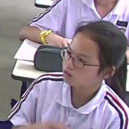
        
        
        
        
        
        
        
        
        
        
        
        
        
        
        
        
        
        
        
        
        
        
        
        
        
        
        
    </div>
    <p class="gallery-caption"><em>Pull up pictures of faces</em></p>
</body>

<body>
    <div class="gallery1">
        <!-- 添加 28 张图片 -->
        
        
        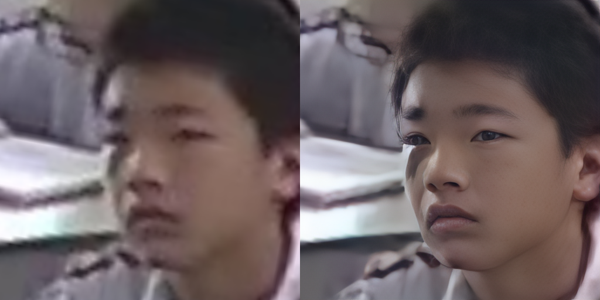
        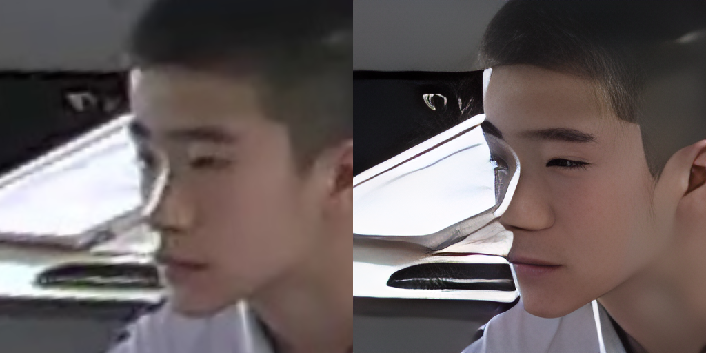
        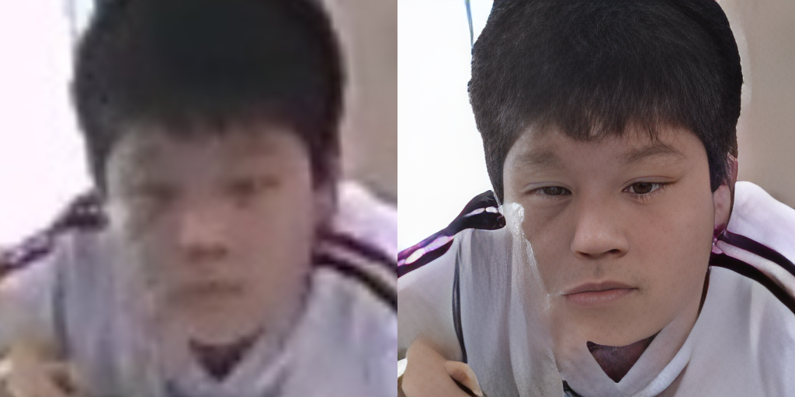
        
        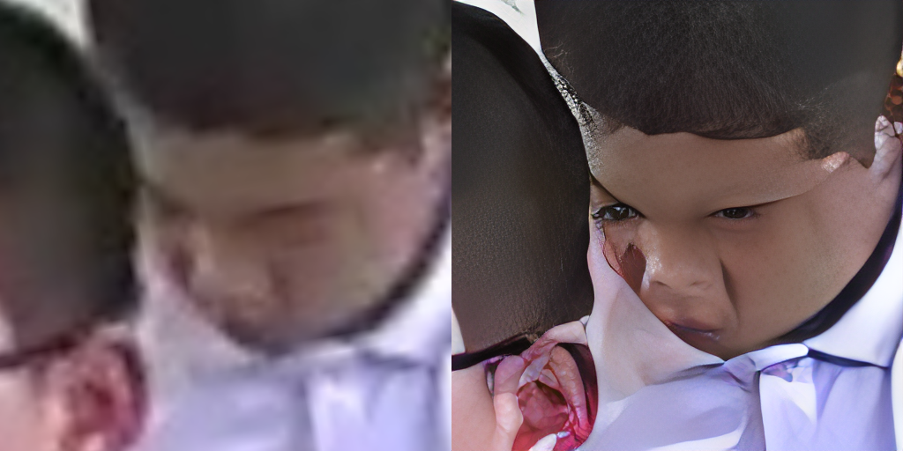
        
        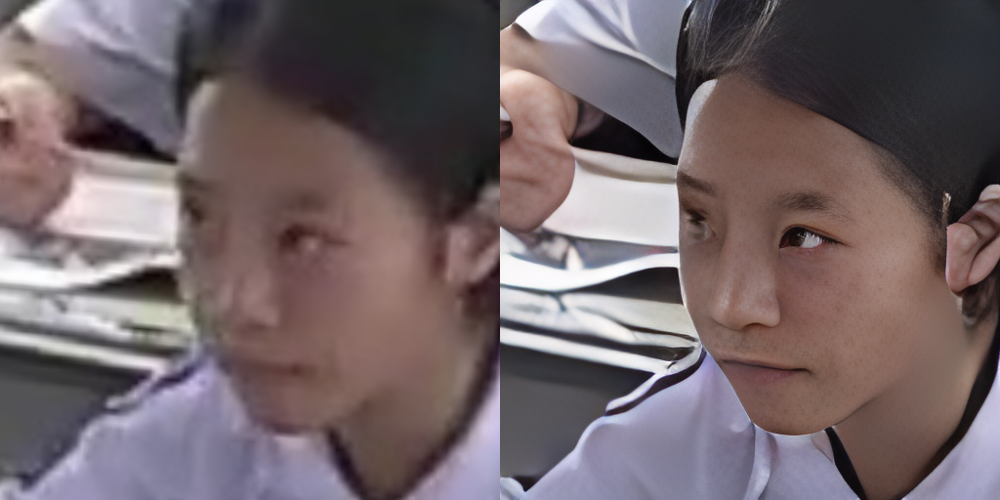
        
        
        
        
        
        
        
        
        
        
        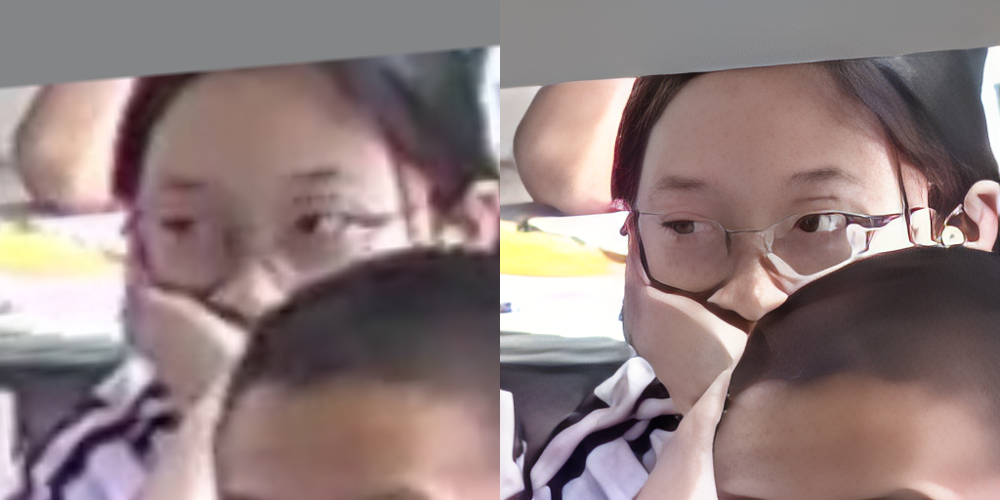
        
        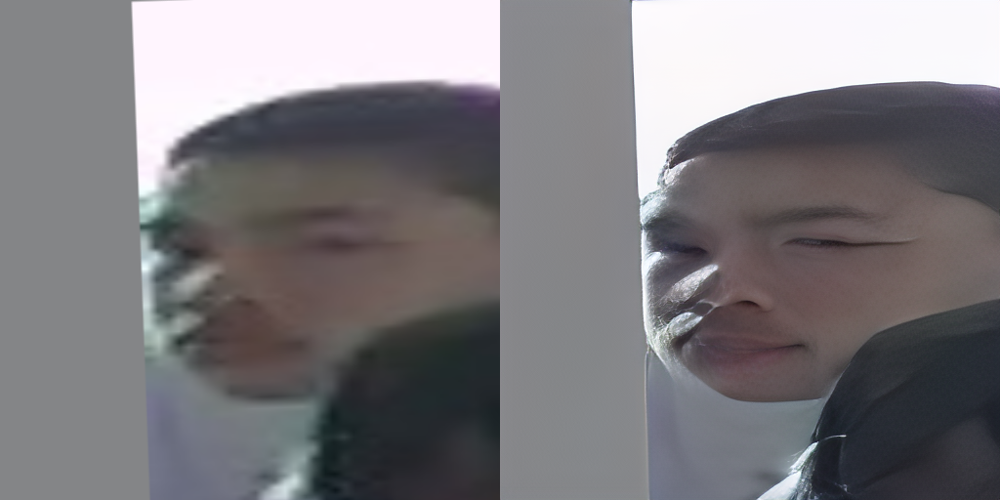
        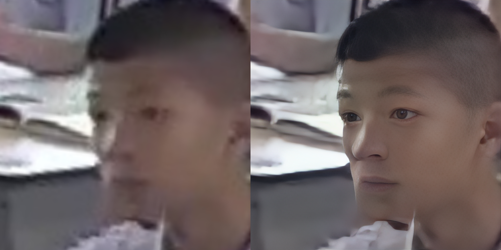
        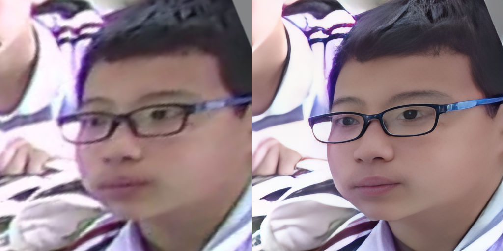
        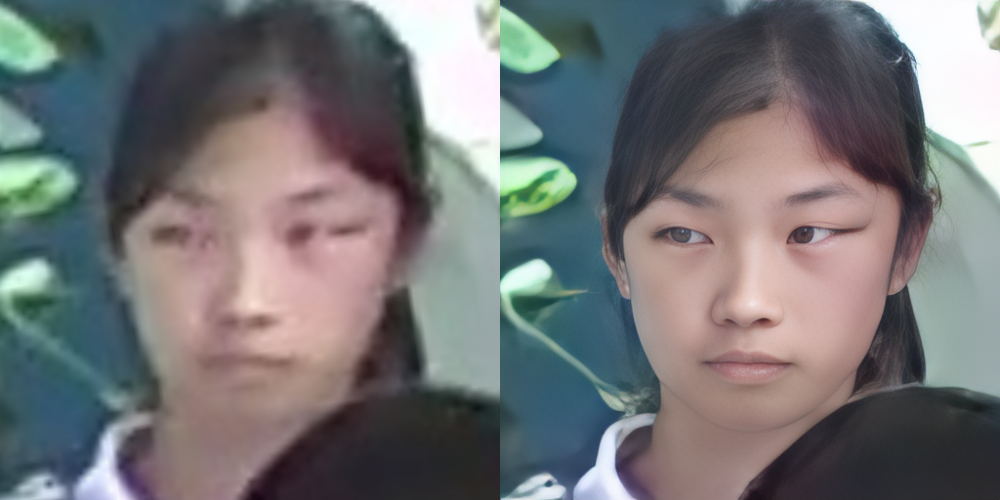
        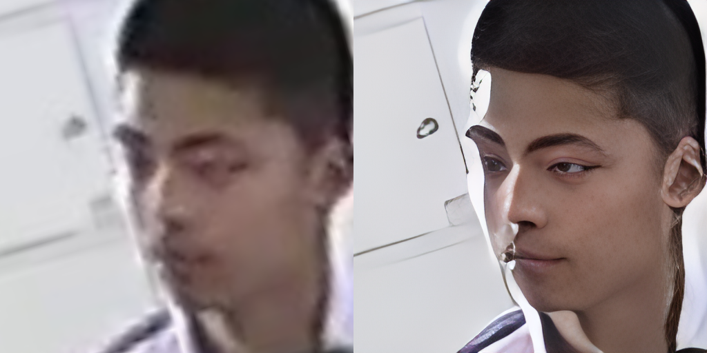
        
        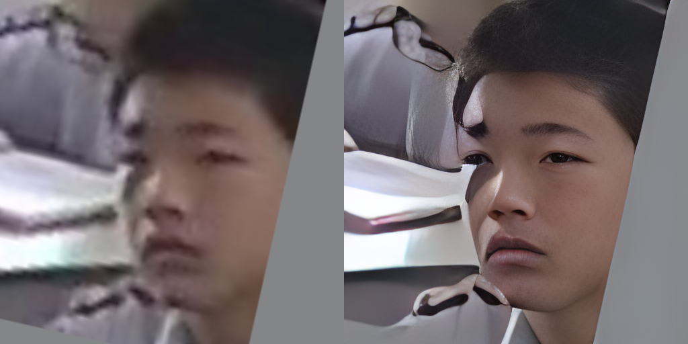
    </div>
    <p class="gallery-caption"><em>Pull up pictures of faces</em></p>
</body>


## Installation [](https://pypi.org/project/retina-face/) [](https://anaconda.org/conda-forge/retina-face)

The easiest way to install retinaface is to download it from [PyPI](https://pypi.org/project/retina-face/). It's going to install the library itself and its prerequisites as well.

```shell
$ pip install retina-face
```

RetinaFace is also available at [`Conda`](https://anaconda.org/conda-forge/retina-face). You can alternatively install the package via conda.

```shell
$ conda install -c conda-forge retina-face
```

Then, you will be able to import the library and use its functionalities.

```python
from retinaface import RetinaFace
```

**Face Detection** - [`Demo`](https://youtu.be/Wm1DucuQk70)

RetinaFace offers a face detection function. It expects an exact path of an image as input.

```python
resp = RetinaFace.detect_faces("img1.jpg")
```

Then, it will return the facial area coordinates and some landmarks (eyes, nose and mouth) with a confidence score.

```json
{
    "face_1": {
        "score": 0.9993440508842468,
        "facial_area": [155, 81, 434, 443],
        "landmarks": {
          "right_eye": [257.82974, 209.64787],
          "left_eye": [374.93427, 251.78687],
          "nose": [303.4773, 299.91144],
          "mouth_right": [228.37329, 338.73193],
          "mouth_left": [320.21982, 374.58798]
        }
  }
}
```


## Acknowledgements

This work is mainly based on the [insightface](https://github.com/deepinsight/insightface) project and [retinaface](https://arxiv.org/pdf/1905.00641.pdf) paper; and it is heavily inspired from the re-implementation of [retinaface-tf2](https://github.com/StanislasBertrand/RetinaFace-tf2) by [Stanislas Bertrand](https://github.com/StanislasBertrand). Finally, Bertrand's [implemenation](https://github.com/StanislasBertrand/RetinaFace-tf2/blob/master/rcnn/cython/cpu_nms.pyx) uses [Fast R-CNN](https://arxiv.org/abs/1504.08083) written by [Ross Girshick](https://github.com/rbgirshick/fast-rcnn) in the background. All of those reference studies are licensed under MIT license.

## Citation

If you are using RetinaFace in your research, please consider to cite its [original research paper](https://arxiv.org/abs/1905.00641). Besides, if you are using this re-implementation of retinaface, please consider to cite the following research papers as well. Here are examples of BibTeX entries:

```BibTeX
@inproceedings{serengil2020lightface,
  title        = {LightFace: A Hybrid Deep Face Recognition Framework},
  author       = {Serengil, Sefik Ilkin and Ozpinar, Alper},
  booktitle    = {2020 Innovations in Intelligent Systems and Applications Conference (ASYU)},
  pages        = {23-27},
  year         = {2020},
  doi          = {10.1109/ASYU50717.2020.9259802},
  url          = {https://doi.org/10.1109/ASYU50717.2020.9259802},
  organization = {IEEE}
}
```

```BibTeX
@inproceedings{serengil2021lightface,
  title        = {HyperExtended LightFace: A Facial Attribute Analysis Framework},
  author       = {Serengil, Sefik Ilkin and Ozpinar, Alper},
  booktitle    = {2021 International Conference on Engineering and Emerging Technologies (ICEET)},
  pages        = {1-4},
  year         = {2021},
  doi          = {10.1109/ICEET53442.2021.9659697},
  url          = {https://doi.org/10.1109/ICEET53442.2021.9659697},
  organization = {IEEE}
}
```

Finally, if you use this RetinaFace re-implementation in your GitHub projects, please add retina-face dependency in the requirements.txt.

## Licence

This project is licensed under the MIT License - see [`LICENSE`](https://github.com/serengil/retinaface/blob/master/LICENSE) for more details.
